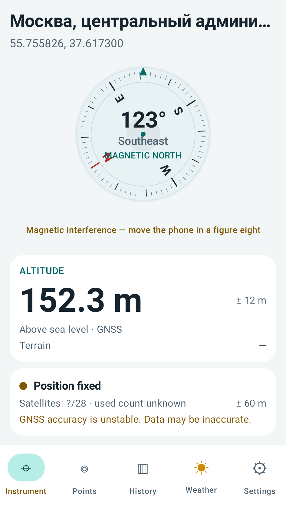
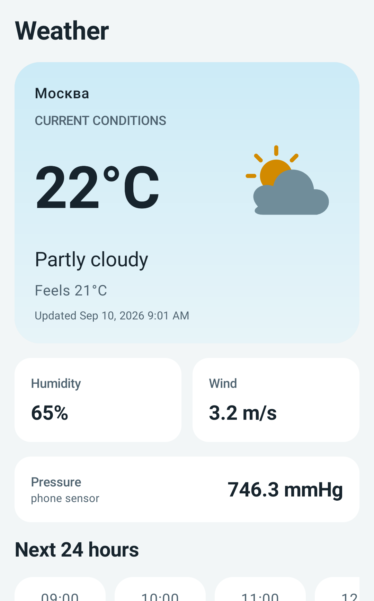
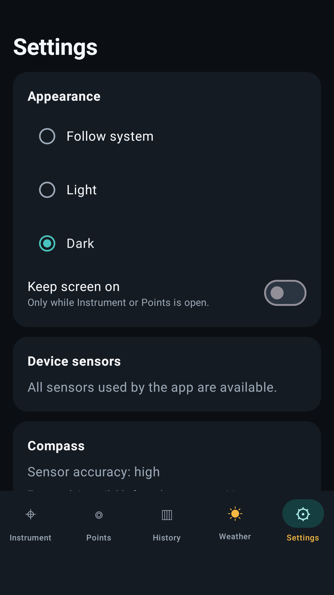

# Altimeter

[English](README.md) | Русский

Нативный офлайн-ориентированный высотомер и компас для Android 8.0 и новее. Google Play Services не требуются.

## Скриншоты

<p align="center">
  
  
  
</p>

## Возможности

- стабильный компас с фильтрацией, честным переключением магнитного/истинного севера, оценкой точности и мастером калибровки;
- координаты, название места, GNSS-фикс и количество используемых спутников;
- предупреждение, если точность GNSS остаётся нестабильной или надёжный спутниковый сигнал долго отсутствует;
- гибридная высота над уровнем моря: GNSS с геоидной поправкой + барометр;
- отдельная справочная высота рельефа Copernicus GLO-90;
- давление с датчика телефона или из погодных данных;
- отдельная вкладка погоды: текущие условия, прогноз на ближайшие 24 часа и 7 дней, давление;
- главный экран с координатами, местом, компасом, высотой и спутниками без прокрутки;
- однократное предупреждение об отсутствующем оборудовании и постоянные сведения в настройках;
- фоновая ручная запись высоты с настраиваемым шагом (по умолчанию 5 метров), интервалом выборки и допустимым возрастом координат;
- локальная история, график, набор/сброс и экспорт GPX/CSV;
- сохраняемые точки возврата с целью на компасе, расстоянием и азимутом;
- десятичные координаты, DMS, UTM и MGRS без сетевого API;
- высотные пороги со звуком/вибрацией при пересечении во время записи;
- 12 языков интерфейса, включая русский, английский, китайский, хинди, испанский и арабский;
- светлая и тёмная темы: автоматический выбор по системе либо ручной в настройках;
- отключаемый режим предотвращения выключения экрана на вкладках «Прибор» и «Точки»;
- включаемый пользователем диагностический GNSS-лог, который можно отправить через системное меню, включая Telegram.

Карты, аккаунты, реклама, аналитика, платные API и облачная синхронизация отсутствуют. Треки хранятся только в локальной базе приложения; резервное копирование Android отключено.

## Сборка

Требуются JDK 17+ и Android SDK 36.

```bash
make check
```

Скрипт автоматически использует `ANDROID_HOME`, `ANDROID_SDK_ROOT`, `sdk.dir`
из локального `local.properties` или стандартные каталоги Android SDK. Отдельные
команды доступны как `make unit`, `make lint` и `make assemble`.

APK будет создан в `app/build/outputs/apk/debug/app-debug.apk`.

Установка на подключённый телефон с включённой USB-отладкой:

```bash
adb install -r app/build/outputs/apk/debug/app-debug.apk
```

## Проверка на Android Emulator

В проекте настроено Gradle Managed Device `pixel2Api29` (Android 10). Gradle
создаёт и запускает изолированный эмулятор, выполняет instrumentation-тесты и
завершает его автоматически:

```bash
make emulator-check
```

При первом запуске Gradle может скачать соответствующий system image. Если уже
запущен обычный эмулятор или подключён телефон с USB-отладкой, используйте
`make device-check`. CI выполняет как стандартную проверку, так и
instrumentation-тесты на эмуляторе.

## Инструменты Codex

Репозиторий содержит инструкции в `AGENTS.md`, Android/Kotlin skill в
`.agents/skills/android-kotlin/` и project-local MCP-конфигурацию в
`.codex/config.toml`. Для актуальной документации AndroidX, Compose, Kotlin и
Gradle включён Context7. MCP `codebase_memory` хранит отдельный семантический
индекс проекта в игнорируемом каталоге `.codebase-memory/`; визуализация графа
доступна на локальном порту `9750`. Серверы из других рабочих проектов здесь отключены.
После первого получения изменений перезапустите Codex, если новые project skills
или MCP не появились в текущей сессии.

Для фоновой записи откройте «История» и нажмите «Начать запись». Управление и состояние записи закреплены снизу вкладки с отступом от меню, в том числе при просмотре деталей. Android покажет постоянное уведомление; остановить запись можно в приложении или из уведомления. Разрешение «местоположение всегда» не используется.

## Диагностика GNSS

Если GNSS работает неправильно, откройте «Настройки» → «Диагностика GNSS», включите запись и воспроизведите проблему на открытом месте в течение 2–5 минут. Затем нажмите «Отправить диагностический лог» и выберите Telegram или другой способ в системном меню.

Функция выключена по умолчанию и ничего не отправляет автоматически. Лог содержит технические сведения об устройстве, прошивке и сигналах спутников, но не содержит точных координат и исходных строк NMEA.

## Точность и офлайн-режим

Компас, координаты, высота телефона, давление и запись работают без сети. Название места зависит от системного геокодера. Погода, прогноз и высота рельефа при отсутствии сети показываются из последнего кэша с соответствующей пометкой. Прошедшие часы и дни прогноза скрываются; время прогноза относится к часовому поясу места наблюдения. Без барометра высота определяется по GNSS, а давление — из погодных данных.

Высота предназначена для бытового использования и походов. Приложение не является сертифицированным авиационным, геодезическим или спасательным прибором. Для наилучших результатов получите GNSS-фикс на открытом месте и откалибруйте компас движением телефона в виде восьмёрки.

## Источники данных

- [Open-Meteo](https://open-meteo.com/) — текущая погода и прогноз, без API-ключа для некоммерческого использования.
- [Copernicus DEM GLO-90](https://spacedata.copernicus.eu/collections/copernicus-digital-elevation-model) через [Open-Meteo Elevation API](https://open-meteo.com/en/docs/elevation-api) — справочная высота поверхности.
- Android `AltitudeConverterCompat` — локальное преобразование GNSS-высоты WGS84 к среднему уровню моря.
- [NGA MGRS Java](https://github.com/ngageoint/mgrs-java) (MIT) — офлайн-преобразование UTM/MGRS в диапазоне UTM 80° ю. ш. — 84° с. ш.

## Лицензия

Altimeter распространяется по лицензии [GNU General Public License только версии 3](LICENSE).
